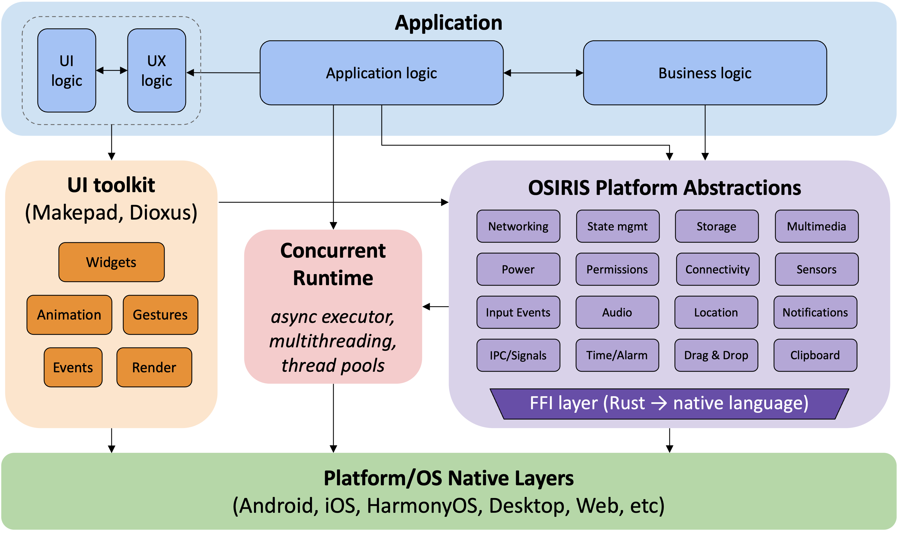
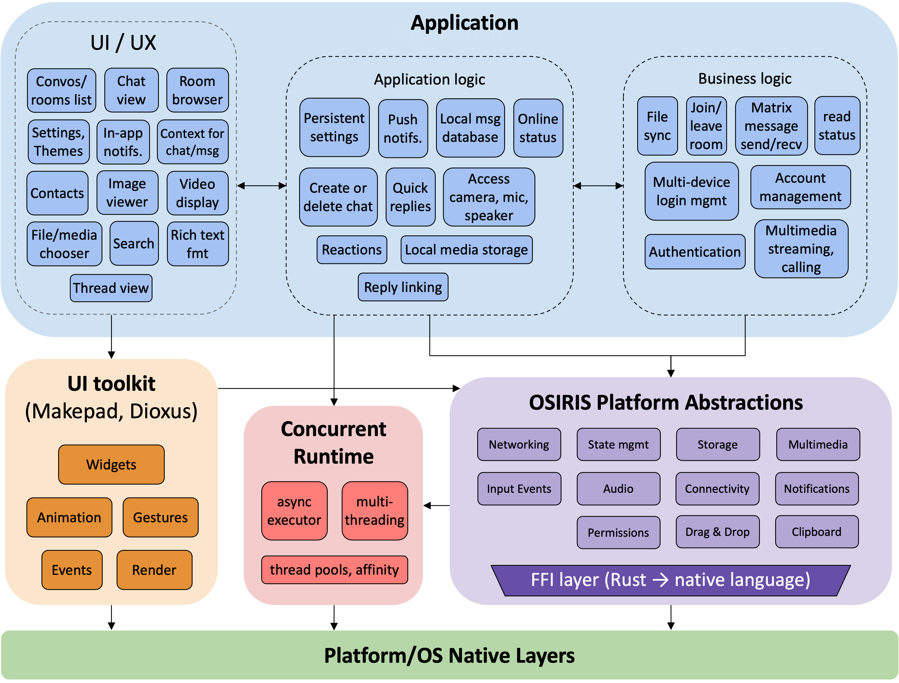

# Project Goals

The Robius project has set forth the following goals:

* Establish a Rust app dev community and drive ecosystem development
* Create reference design of full app + system stack
* Develop flagship apps and simpler demo apps as proofs of concept
*  [Future] Give feedback to Rust's lang, libs, and cargo teams 

The following sections provide more details on each of these goals.
All in all, we hope that Robius will attract front-end developers to the world of Rust and encourage existing Rust experts to broaden their horizons and explore the application development domain as well.

## Community and ecosystem
Our goal is to establish the Robius project as a collective, communal space for all things related to multi-platform app development in Rust.
As this community doesn't yet exist, we are building it from the ground up.
Thus far, we have the [`project-robius` GitHub organization](https://github.com/project-robius/) that aims to serve as a starting point, but once the vision has had more time to incubate and grow, we will create a working group related to app dev in Rust.
We also intend to host and maintain an "are we app yet" website that tracks the status and progress of our Rust app dev work in a public and easy-to-follow format.

As part of building this community, we aim to collect and maintain a set of crates related to app dev that are highly functional and actively supported.
In short, this amounts to identifying key projects in the space and inviting their authors, maintainers, and contributors to participate in the larger Robius vision.
Thus far, we have welcomed two major UI frameworks, Makepad and Dioxus, and a platform abstraction framework, Osiris, into the community.
We aim to foster collaboration between these founding projects in order to enable each project to jointly benefit from contributions and improvements to other projects.

> If you are interested in adding your project or suggesting another project to add to Robius, please don't hesitate to reach out to us.
> We're always looking for more projects to include in the Robius ecosystem!

Another major goal of the Robius vision is to drive the *non-code* components of the ecosystem forward, i.e., documentation.
This whitepaper is one example, but we also strive to publish and support holistic (cross-project) docs and detailed tutorials, as well as provide a platform for blogs and discussion forums related to Rust app development.

## Reference design for full-system stack

The central goal of the Robius project is to deliver a complete working solution for multi-platform app development, in which all components in both the application and the systems stack are written in Rust.

We call this a "reference design" because it embodies only *one* incarnation of how the ecosystem of loosely-coupled components can be assembled into a fully-working stack.
The intent is for the reference design to act as a "blessed" systems stack that new developers can use to quickly and easily start building apps, i.e., a pre-integrated combination of components that are known to work well together.
At the same time, we wish to allow expert developers to tailor the stack to meet their more complex needs, e.g., by selecting or building different components to replace individual pieces of the stack.

The goal of the Robius reference design is to support all major platforms and OS environments, with mobile and desktop being the priority targets:
* Mobile: Android, iOS
* Desktop: Linux, macOS, Windows
* Other: OpenHarmony
* Web (plus WebAssembly) 

The following diagram shows the proposed architecture of this reference design, which is described in greater detail in the system architecture section of this whitepaper.

## Flagship apps and examples

In addition to the systems stack reference design, our other important deliverable goal is a series of open-source applications, in two broad categories:
1. Flagships apps
    * Full set of features with robust UI & UX
    * Intended for actual usage/dogfooding
    * Commercial quality; publishable to app stores
2. Example/demo apps
    * Simple structure intended to demonstrate a single feature
    * Minimal, incomplete UI & UX
    * Missing features represented by mock stub implementations, e.g., simulated server/database backends
    * Can be used for automated testing/benchmarking

We will strive for both flagship and example applications to be designed clearly, well-structured, thoroughly commented, and accompanied by documentation like a tutorial-style walkthrough.
The overarching goal is for these apps to be easily forked and modified by new developers, such that they can use these apps as templates for a quick start.

Our primary flagship application will be a Matrix chat client, tentatively called Robrix (Robius + Matrix).
The rationale behind this decision is manyfold:
* The Matrix protocol, like Robius, is open-source, free, and decentralized.
* A chat client's features depend on a wide set of functionality from the underlying system, which will help steer and prioritize development of Osiris and its integration with UI toolkits like Makepad.
* A chat client consists of multiple different UI views, which will drive development of a robust widget library and an expanded set of UI toolkit features.
* It requires complex app/business logic like user authentication and account management, sending, receiving, and synchronizing messages, handling persistent state (caching, settings), delivering notifications, accessing local storage, etc.
* Demanding features can be optionally added to stress test our system abstractions, e.g., audio/video chat, multimedia capture and playback, image display, etc.
* Several Matrix chat clients already exist, which comprise a good basis for comparison between the Robius framework and the frameworks used to implement those clients. We can evaluated both the qualitative development experience and resulting application behavior of Robrix as well as its quantitative performance, relative to that of the other chat clients.

The below diagram shows a tentative overview of the architecture of Robrix, including the components needed to realize its full set of features. We note that while this a multi-year endeavor, we hope to have a basic MVP available by mid-2024.

For the example applications, some initial ideas are listed below, several of which are already in progress.
* Simple to-do or notes app
* Social media news feed, e.g., Twitter, Facebook
* Social video sharing apps, e.g., TikTok, YouTube shorts
* Shopping/e-store app, e.g., Taobao, eBay, Amazon, Etsy
* Basic drawing/sketch app, e.g., paint

## Advertise business value of Robius

In the long term, our ultimate goal is drive the development of Robius into a robust, stable ecosystem that inherently demonstrates what is possible with Rust.
We can then leverage the positive experiences of creating apps atop Robius to evangelize for the usage of Rust in the app dev world, especially in business scenarios.

Our objective is to show that businesses stand to gain the following benefits from switching to Robius, many of which correspond to [the motivating factors](./motivation/business_cases.md) behind the Robius vision itself.
* Usage of a modern framework and highly-desired language tends to attract top developers and improve team culture and morale.
* A multi-platform framework reduces headcount overhead, as developers only need to know Rust and the framework, not the intimate details of each platform.
* Customers get to enjoy a more consistent UI and UX across disparate platforms.
* Maintainability is easier, enabling more rapid and consistent bug fixes at lower cost, which also leads to higher customer satisfaction and engagement.
* Smooth integration with the rest of Rust's huge ecosystem of crates allows developers to lean on the significant shoulders of open-source projects, especially beyond UI elements.
* An open-source, distributed, and decentralized project structure gives business leaders confidence about the staying power and independent directions of the framework.
* Last but not least, developers get to use Rust!

