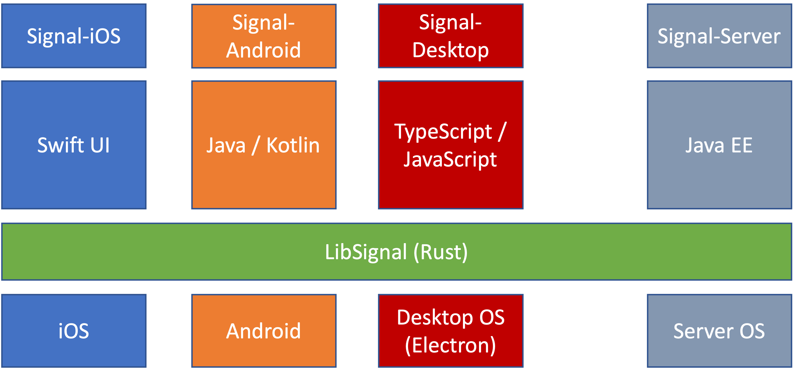
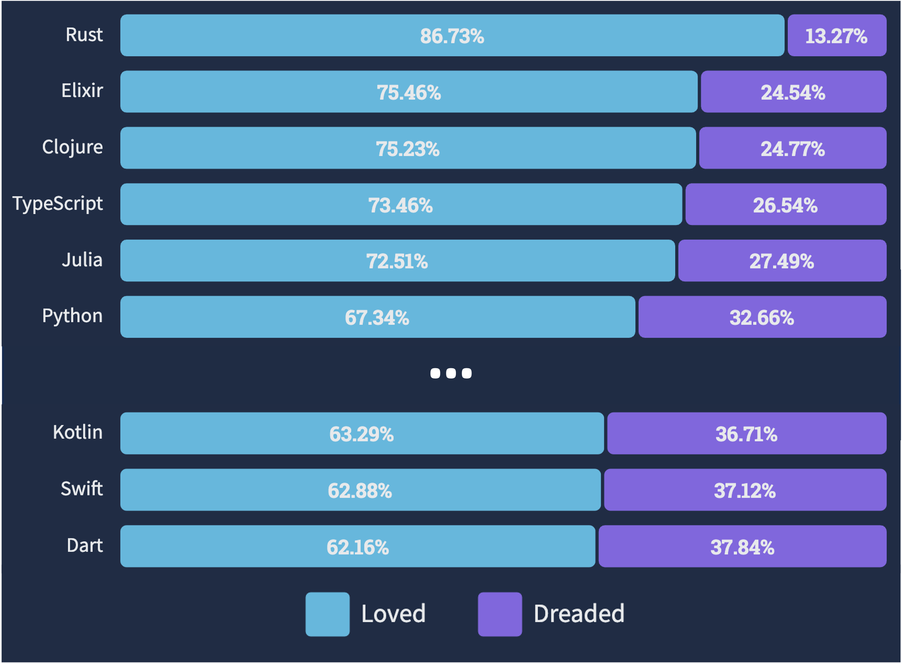
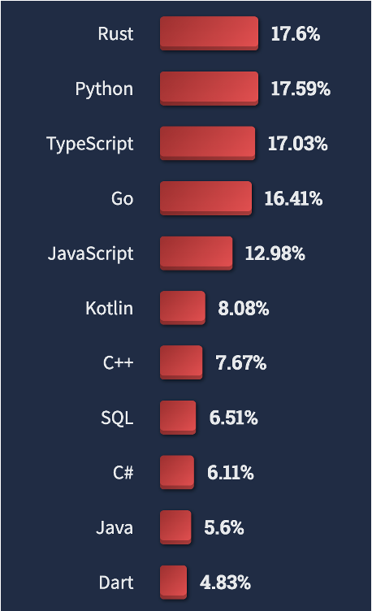

# Motivation: why Robius?

Several motivating factors inspired us to start the Robius project:

1. App developers want to use Rust, but aren’t sure where or how to get started due to Rust's app dev ecosystem being in a rough state. 
<!-- 
    * Paralysis of choice among dozens of partial solutions
    * Unclear how to integrate many disparate projects
     -->
2. There are clear **business advantages** to writing applications in a multi-platform Rust framework.
<!-- 
    * Consistent experience for devs and customers
    * Avoid redundant dev effort → save money, faster time to market
     -->
3. Rust is a great language and the right choice for many programming domains, but not for multi-platform apps ... *yet*.
<!-- 
    * Safety → increased correctness, reliability
    * Performance efficiency → responsive, jank-free UI
    * Potential to unify two dev worlds: systems + frontend apps
-->

The following sections examine each of these factors in detail.

## 1. Developers *really* want to write apps in Rust
<!-- ## 1. Developers express great interest in writing Rust apps -->

<!-- 
* App developers want to use Rust, but are unsure how to get started
    * Fractured ecosystem – many competing crates
        * Official Rust project team/ecosystem doesn’t recommend any specific toolkit
        * Discovery of crates is difficult, non-standardized
        * Many crates offer overlapping features, are abandoned/incomplete
    * Unclear integration opportunities
        * Which crates work with which others?
    * Poor documentation; lack of examples, tutorials
-->

Online programming forums are filled with posts asking how to use Rust to develop mobile, desktop, and web applications. 
We have observed this trend for several years in two main flavors:
* Existing Rust systems-level developers that wonder if they can leverage their Rust knowledge for applications too.
* Frontend app developers that currently use other languages, but want to use Rust because they have heard about its benefits. 

The former group of Rust devs is mainly focused on the biggest unknown to them: creating GUI apps and packaging apps up for mobile targets; this is the first group that we wish to support with Robius.
The latter group of frontend devs have deeper expertise in application-level implementation but are not sure how to transition those skills to the world of Rust; this is the second group that we wish to support.
One major commonality is that both groups are unsure how or where to start developing an app in Rust.

### Ecosystem is fractured and incomplete
The first problem that most aspiring devs encounter is the massive collection of projects, mostly GUI libraries, many of which are incomplete proofs-of-concept or simply abandoned.
Though there are many competing UI frameworks in the main `crates.io` registry, it is difficult to discover which ones are most appropriate for a given application's needs, and even harder to determine whether and how these projects can be integrated with others to form a functional app dev toolkit.

For more evidence, look no further than the [`areweguiyet.org`](https://areweguiyet.com/) website, which aims to track the bevy of GUI crates and their progress. Their homepage states:

> As a low level language, Rust is perfectly suitable for making user interfaces the old fashioned way, with native APIs. However, competing in today's world typically means supporting many platforms, and that makes using native APIs an unattractive option for many.
>
> Rust's expressiveness and high level abstractions make it ideal for building intricate and complex user interfaces. Unfortunately, there is little consensus on what the best abstractions are.
>
> There are a number of bindings available today to existing frameworks, but those looking for a mature, easy to use, and completely Rust-based solution will most likely find themselves out of luck.

Due to the relatively young age of the Rust language itself, many of these crates are incomplete, as building a UI toolkit is a lengthy endeavor.
Most are only proofs-of-concept that offer barebones UI primitives; 
even the more mature and fully-developed crates only offer a partial solution for application development, focusing primarily on the UI appearance and fundamental UX behavior. 

As expected, there is not yet a de facto "best" toolkit, nor has the Rust Foundation or Rust project teams made any official recommendation or guidebook concerning this matter.
Although this is good for the sake of both neutrality and healthy competition, it has led to a fractured ecosystem in which nearly every crate has significant overlap with the functionality of several other crates.
This overlap makes it even harder to select a UI toolkit for a new app, as the differences between toolkits are minimal on paper and only become evident after several weeks of development experience with each one.

All in all, there is a noticeable absence of cohesion and coordination in this ecosystem, presenting the most significant barrier of entry to cross-platform application development in Rust.
This is especially evident when compared to app dev frameworks led by a single directing entity, such as React Native or Flutter. 

### Apps need more than just UI + UX
Even if GUI development in Rust was a solved problem, UIs do not tell the whole story — an application still needs to access services and features from the underlying platform or OS.
As with UI works, there are indeed a plethora of crates that offer basic interfaces to access platform-specific features.
Some offer general abstractions of a single feature across multiple platforms, while others or specific features on a single platform.

These features are crucial to developing *immersive* applications that take full advantage of the software and hardware functionality afforded to them by the device platform.
For example, robust applications typically expect an app dev framework to expose the following:
* camera, multimedia (audio and video) capture and playback, 
* geolocation, haptic feedback actuators like vibration motors,
* system services like notifications, drag and drop, a rich clipboard,
* on-device sensors like accelerometers/gyros, barometers, thermometers, proximity and ambient light sensors, etc,
* local communication protocols like WiFi, Bluetooth, NFC, and more,
* typical I/O like storage, cache space, and networking, in a platform-native manner.

While these crates can certainly be used directly by an application, this model places the serious burden of assembling multiple piecemeal crates into a workable platform abstraction on the shoulders of the application developers themselves.
This expectation is not feasible for most application developers, as they are neither sufficiently experienced nor have the time to undertake such an arduous task.

That is why we created the [**Osiris project**](https://github.com/osiris-apis/osi) — to fill in the gaps and offer a fully-integrated, consistent solution for accessing platform-specific functionality in an abstract manner.

### Documentation is paramount

Another reason many newcomers find it so difficult to get started is that there is a distinct lack of documentation, tutorials, and examples for the vast majority of crates in this domain.

If examples exist, they are extraordinarily simple and only cover the basics of setting up a primitive UI or application skeleton.
Holistic tutorials and complete examples are few and hard to come by, which exacerbates the integration problem. 
Without end-to-end sample code, it is challenging for an expert, let alone a newcomer to the worlds of app dev and Rust, to compose a working system stack by integrating multiple disparate crates together. 

One guiding light in this space is Dioxus, which has [recently released high-quality comprehensive documentation](https://dioxuslabs.com/learn/0.4/reference) for both external users and internal contributors along with several well-commented demo apps, making it both easy and enticing to use Dioxus to create new apps.

For a Rust application development framework to gain real traction, it must lead the pack in terms of documentation quality, tutorial thoroughness, and variety and depth of real-world example application code.

<!-- 
-------------------------------------------------------------------------------
-------------------------------------------------------------------------------
 -->

## 2. Rust app dev offers clear business advantages

There is a strong business case to be made for application development in Rust.
Several existing commercial applications have already been "written in Rust," but Rust is only used to implement an internal business logic layer; the entire remainder of the app (e.g., frontend UI and UX) is written using different platform-specific native languages and SDKs.
This leads to significant fragmentation and redundant development effort on each platform they wish to support, i.e., wasted expense.

One such example is [Signal](https://signal.org/), a popular open-source messaging app focused on user privacy. 
As pictured below, Signal maintains multiple separate repositories for each of its client apps on [Android](https://github.com/signalapp/Signal-Android), [iOS](https://github.com/signalapp/Signal-iOS), and [desktop](https://github.com/signalapp/Signal-Desktop), as well as for its [server](https://github.com/signalapp/Signal-Server).
The Rust component of Signal is the shared [`libsignal` crate](https://github.com/signalapp/libsignal), which implements the main Signal protocol functionality in a platform-agnostic manner with multiple bindings to other platform-native languages like Swift, Typescript, and Java.

Each of these app repositories are non-trivial in size: 450K+ LoC on iOS, 350K+ LoC on Android, and 250K+ LoC on desktop.
The only reason the Signal desktop app is not even more complex and large is because it is built atop the [Electron](https://www.electronjs.org/) framework, which is known to be an [inefficient resource hog](https://github.com/signalapp/Signal-Desktop/issues/2178#issuecomment-378233583) with [poor accessibility](https://github.com/signalapp/Signal-Desktop/issues/2178#issuecomment-384911415) support.
However, building desktop apps on Electron is still the default choice because it is easy and familiar, and at the time there were no viable alternatives to [the much more expensive option](https://github.com/signalapp/Signal-Desktop/issues/2178#issuecomment-376466372) of per-platform native apps on Windows, macOS, and Linux. 

The main disadvantage of having multiple separate app repos is that it is incredibly challenging maintain consistentcy in both appearance and behavior.
General maintainability also becomes more tedious, as bugs that manifest differently across platforms must be addressed on an individual basis.
To their credit, Signal has actually done an impressive job of just that, with help from the community, though naturally some minor issues do slip through the cracks.
For example, Signal on Android allows placing secure chats behind a screen lock (e.g., using biometrics), but desktop Signal does not offer that.
Signal on Android cannot search only a single chat only, while other platforms support that filter.
Mobile Signal apps offer contact-specific notifications, while desktop does not.
The iOS app does not allow choice of fonts or changing font sizes and has different defaults than others, e.g., for embedded link previews, WiFi vs. cellular data usage, etc.

Another similar motivating example is [Element](https://element.io/), a first-party [Matrix chat](https://element.io/matrix-benefits) client that is also implemented separately on each platform, including [Android](https://github.com/vector-im/element-android), [iOS](https://github.com/vector-im/element-ios), [desktop](https://github.com/vector-im/element-desktop), and [web](https://github.com/vector-im/element-web).
Unfortunately, the maintenance burden has proven difficult to handle, with Element apps receiving moderately poor user reviews ([3.8⭐ Google Play](https://play.google.com/store/apps/details?id=im.vector.app), [3.5⭐ on Apple's App Store](https://apps.apple.com/us/app/element-messenger/id1083446067)) due to inconsistent behavior, bugs, and slow performance.
This undoubtedly stems from the effort required to accommodate the idiosyncracies of each platform, which steals developer focus away from improving the main app-level features and experience.

Element themselves have acknowledged this issue and began developing a new set of applications called Element X, with a focus on sharing code across platforms via a shared [Matrix Rust SDK](https://github.com/matrix-org/matrix-rust-sdk).
They are also exploring a new design system called [Compound](https://compound.element.io/) that aims to establish consistent UI component implementations shared across iOS, Android, and the web.
However, both [Compound](https://github.com/vector-im/compound#related-projects) and Element X apps on [Android](https://github.com/vector-im/element-x-android) and [iOS](https://github.com/vector-im/element-x-ios) still exist separately and are implemented with platform-specific UI frameworks, e.g., Jetpack Compose and SwiftUI.

Element claims that the Element X apps are [up to 6000 times faster](https://element.io/blog/element-x-experience-the-future-of-element/) than the legacy Element apps, due in part to Rust:

> Our new Rust SDK makes development faster and more consistent across the Android and iOS apps, while providing a super-speedy and high quality implementation thanks to Rust’s legendary language safety features. 
> 
 — Element X blog post, July 6, 2023

Although the new sliding sync protocol is likely responsible for the majority of those performance gains, this statement speaks to the **attitude surrounding Rust** — that switching to Rust will bring 💪 huge gains 💪.

In general, a business stands to gain several competitive advantages from using a cross-platform Rust app dev toolkit, as listed below. These mostly overlap with the benefits of switching to Flutter[^1], though [as shown later](#rust-is-increasingly-popular-admired-and-wanted), d`evelopers vastly prefer using Rust over Dart, Flutter's required language.
* Ability to deliver a more consistent experience to customers across platforms.
* Ease of attracting talented developers due to a modern stack and better team culture/morale[^1].
* Elimination of redundant development effort across platforms, which: 
    * Saves money due to higher productivity, 
    * Results in a faster time to market, and
    * Allows developers to focus more on UI/UX quality.

In conclusion, these favorable Rust experiences, together with Signal's and Element's challenging experiences with separate per-platform app repos, clearly motivate the need for a multi-platform application development toolkit in Rust.

[^1]: A [survey by Very Good Ventures](https://verygood.ventures/whitepaper/business-value-of-flutter) found that businesses reported these benefits when switching to Flutter for app development. 

<!-- 
-------------------------------------------------------------------------------
-------------------------------------------------------------------------------
 -->

## 3. Rust is the right choice for the future of app dev

Both current trends and key aspects of Rust reinforce our assertion that Rust is the best choice for the next generation of multi-platform application development.

### Rust is increasingly popular, admired, and wanted

Rust has been voted the most admired language for the past 8 years in a row (2015 - 2023), according to the [StackOverflow annual developer survey](https://survey.stackoverflow.co/2023/).
For the first time, Rust also became the most wanted language this year (2023).

  
  

In addition, Rust is leading the development of technologies for new platforms, e.g., it is the [most frequently used language for WebAssembly (WASM)](https://blog.scottlogic.com/2023/10/18/the-state-of-webassembly-2023.html) for the third year running.

The same study also found that:
* Developers of WASM tools have a strong preference for Rust,
* Rust is the most *desired* language for projects involving WASM, and
* The leading and most-used WASM runtimes are written in Rust, the [Wasmtime] and [wasmer] projects.

[Wasmtime]: https://github.com/bytecodealliance/wasmtime
[wasmer]: https://github.com/wasmerio/wasmer

These trends indicate that Rust adoption will continue to grow, and that other developers are open and willing to learn Rust in order to use it for new applications.

### Rust combines safety with usability and performance

Coming soon!

<!--
If you're reading this book, you likely already know about the strengths of Rust and the benefits that it provides.
ensures safety with no runtime costs

* Rust offers safety and performance
    * Safety leads to increased correctness, eliminating memory & concurrency bugs
        * Higher reliability, less developer frustration and debugging difficulties
        * Amenable to formal verification and type-carried invariants
    * Less runtime overhead via static (compile-time) checking and guarantees
        * Focus on zero-cost abstractions (e.g., async state machines)
        * No garbage collection, static memory lifetime analysis
        * Monomorphization of generics
        * const eval, etc
    * Interactive systems, especially mobile, require good performance and efficiency; achievable with Rust 
        * Performance is key for a smooth, responsive UI without jank
        * Efficiency is key for longer battery life, less heat output
    * Built-in support for easy cross-platform compilation targeting
    * Good, clear dependency management via cargo

-->

### Rust's core ecosystem is excellent

Finally, Rust comes with an excellent suite of features and tooling beyond the core language itself.
First, Rust's primary compiler `rustc` [uses LLVM as a backend](https://rustc-dev-guide.rust-lang.org/overview.html#code-generation), which affords it two main benefits: 
1. Rust can leverage LLVM's existing support for [a wide set of target triples](https://doc.rust-lang.org/rustc/targets/index.html), including many architectures, target OS platforms, and library environments.
    * Most importantly, the compiler supports cross-compiling by default, making it super easy to build code for a different target than your host. To state the obvious, quick and easy cross-compilation is a **key prerequisite** for a multi-platform app dev framework.
2. Despite being a relatively young language, Rust can immediately realize highly-optimized code generation thanks to decades of effort poured into LLVM by compiler experts.

Second, Rust's package manager [`cargo`](https://doc.rust-lang.org/cargo/) vastly simplifies discovering, specifying, and correctly building dependencies for your project.
It integrates tightly with [`crates.io`](https://crates.io/), a registry of crates (projects) from the Rust community that makes it trivial to publish, distribute, and depend on other open-source crates.
Furthermore, cargo makes it easy to specify dependencies as an exact version or a range of versions of a given crates by utilizing [SemVer](https://doc.rust-lang.org/cargo/reference/resolver.html#semver-compatibility) semantic versioning.
This design avoids the versioning hell that frequently plagues other languages and package manager, and there are even [community-provided tools](https://github.com/rust-lang/rust-semverver) to ensure semver compliance when releasing new versions of a crate.

## Rust does have some relevant shortcomings 

Coming soon!

<!--
TODO: see powerpoint slides (slide 16)

* Some deficiencies / weak points from a UI standpoint
    * Lack of familiar OOP patterns; UI folks are accustomed to inheritance 
    * Difficult to realize shared mutable state
        * Typical closure-based callback pattern → overuse of  Rc<RefCell<…>> 
    * Compilation is “slow”
        * But constantly improving … wait for Nick’s talk

* Potentially steep learning curve for frontend devs
    * A survey from VFV about transitioning frontend devs from a native platform language to Flutter (the pre-eminent cross-platform app dev framework)

-->
