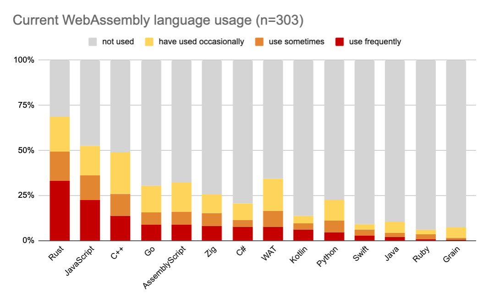

## 3. Rust is the right choice for the future of app dev

Both current trends and key aspects of Rust reinforce our assertion that Rust is the best choice for the next generation of multi-platform application development.

### Rust is increasingly popular, admired, and wanted

Rust has been voted the most admired language for the past 8 years in a row (2015 - 2023), according to the [StackOverflow annual developer survey](https://survey.stackoverflow.co/2023/).
For the first time, Rust also became the most wanted language this year (2023).

  
  

In addition, Rust is leading the development of technologies for new platforms, e.g., it is the [most frequently used language for WebAssembly (WASM)](https://blog.scottlogic.com/2023/10/18/the-state-of-webassembly-2023.html) for the third year running.

The same study also found that:
* Developers of WASM tools have a strong preference for Rust,
* Rust is the most *desired* language for projects involving WASM, and
* The leading and most-used WASM runtimes are written in Rust, the [`Wasmtime`] and [`wasmer`] projects.

[`Wasmtime`]: https://github.com/bytecodealliance/wasmtime
[`wasmer`]: https://github.com/wasmerio/wasmer

These trends indicate that Rust adoption will continue to grow, and that other developers are open and willing to learn Rust in order to use it for new applications.

### Rust combines safety with usability and performance

If you're reading this book, you likely already know about the strengths of Rust and the benefits that it provides.
If not, we cover a select subset of those benefits here.

First, Rust's strong, static type system guards against type errors at compile time, enabling full type safety.
This type safety leads to memory safety, which eliminates entire classes of bugs: use after free, double free, buffer overflow and underflow, reading uninitialized memory, concurrency violations like race conditions, and more.

Rust's memory safety is also statically determinable due to its type-based [ownership model](https://doc.rust-lang.org/nomicon/ownership.html) and [borrow checker](https://doc.rust-lang.org/book/ch04-02-references-and-borrowing.html), which operate at compile-time.
This allows Rust programs to execute efficiently without an underlying runtime or a garbage collector, as memory safety and resource management operations (like cleanup routines that invoke destructors) are deterministically inserted *by the compiler* when a resource is released by its owner (e.g., falls out of scope).

Another aspect of Rust that contributes to its high performance is its focus on zero-cost abstractions, in which libraries expose higher-level, easier-to-use programming interfaces that still compile down to the equivalent of manually-optimized machine code.

Some concrete examples of great Rust features include:
* Default [immutability](https://doc.rust-lang.org/book/ch03-01-variables-and-mutability.html#variables-and-mutability) of variables, [scoped bindings and shadowing](https://doc.rust-lang.org/book/ch03-01-variables-and-mutability.html#shadowing), [loops with labels](https://doc.rust-lang.org/book/ch03-05-control-flow.html#loop-labels-to-disambiguate-between-multiple-loops), and more.
* [Struct definitions](https://doc.rust-lang.org/book/ch05-00-structs.html) with [flexible naming visibility](https://doc.rust-lang.org/book/ch07-02-defining-modules-to-control-scope-and-privacy.html), [newtype wrapper patterns](https://doc.rust-lang.org/book/ch05-01-defining-structs.html#unit-like-structs-without-any-fields), [heterogeneous tuples](https://doc.rust-lang.org/book/ch03-02-data-types.html#the-tuple-type), etc.
* Excellent sum types ([`enum`s](https://doc.rust-lang.org/book/ch06-00-enums.html)) with contained values, which, along with very ergonomic [pattern matching](https://doc.rust-lang.org/book/ch06-02-match.html), provides [excellent error handling](https://doc.rust-lang.org/book/ch09-02-recoverable-errors-with-result.html) using types like `Option` and `Result`.
* Support for [generic type parameters](https://doc.rust-lang.org/book/ch10-00-generics.html) for types (structs), functions, associated trait items, and even [explicit lifetimes](https://doc.rust-lang.org/book/ch10-03-lifetime-syntax.html) for borrowed values.
* Abstraction of interfaces using [traits](https://doc.rust-lang.org/book/ch10-02-traits.html), which can bound generic type parameters and even be used to imitate OOP-like polymorphism.
* Const evaluation of expressions at compile time.
* `async` functions and traits, which the compiler transforms into state machines.
* [Functional programming language features](https://doc.rust-lang.org/book/ch13-00-functional-features.html) like iterators, closures with value capturing, combinators, and more.
* Both hygienic [declarative macros](https://doc.rust-lang.org/book/ch19-06-macros.html#declarative-macros-with-macro_rules-for-general-metaprogramming) as well as [procedural macros](https://doc.rust-lang.org/book/ch19-06-macros.html#procedural-macros-for-generating-code-from-attributes) for expressive meta-programming.

Static type and memory safety enable Rust to catch many classes of bugs at *compile-time*, which reduces developer frustration, minimizes debugging difficulties, and provides a higher degree of confidence that a program will run correctly and reliably after deployment.
Early error detection combined with [Rust's excellent documentation](https://www.rust-lang.org/learn), [tutorial books](https://doc.rust-lang.org/book/), IDE [language server plugins like `rust-analyzer`](https://rust-analyzer.github.io/), detailed compiler error messages enable developers to be much more productive than other languages.

In addition, Rust's safety model can restrict possible root causes of bugs to [`unsafe` code](https://doc.rust-lang.org/book/ch19-01-unsafe-rust.html) regions, though not for basic logic bugs. 
Rust is also amenable to [formal verification](https://rust-formal-methods.github.io/tools.html), both in terms of verifying soundness of unsafe code blocks, correctness of unsafe-safe code boundaries, and correctness of type-carried invariants.

While most Rust features and benefits apply to all platforms and execution environments, certain ones are key for mobile platforms.
High performance is particularly important in interactive systems like mobile devices, in order to provide a smooth, responsive UI/UX without jank.
Similarly, efficient operation is crucial to extend usable life in battery-powered devices and reduce thermal output in body-proximal hardware without active cooling.

### Rust's core ecosystem is excellent

Finally, Rust comes with an excellent suite of features and tooling beyond the core language itself.
First, Rust's primary compiler `rustc` [uses LLVM as a backend](https://rustc-dev-guide.rust-lang.org/overview.html#code-generation), which affords it two main benefits: 
1. Rust can leverage LLVM's existing support for [a wide set of target triples](https://doc.rust-lang.org/rustc/targets/index.html), including many architectures, target OS platforms, and library environments.
    * Most importantly, the compiler supports cross-compiling by default, making it super easy to build code for a different target than your host. To state the obvious, quick and easy cross-compilation is a **key prerequisite** for a multi-platform app dev framework.
2. Despite being a relatively young language, Rust can immediately realize highly-optimized code generation thanks to decades of effort poured into LLVM by compiler experts.

Second, Rust's package manager [`cargo`](https://doc.rust-lang.org/cargo/) vastly simplifies discovering, specifying, and correctly building dependencies for your project.
It integrates tightly with [`crates.io`](https://crates.io/), a registry of crates (projects) from the Rust community that makes it trivial to publish, distribute, and depend on other open-source crates.
Furthermore, cargo makes it easy to specify dependencies as an exact version or a range of versions of a given crates by utilizing [SemVer](https://doc.rust-lang.org/cargo/reference/resolver.html#semver-compatibility) semantic versioning.
This design avoids the versioning hell that frequently plagues other languages and package manager, and there are even [community-provided tools](https://github.com/rust-lang/rust-semverver) to ensure semver compliance when releasing new versions of a crate.

Third, the set of packages available in the Rust world is *far* larger in both number and scope than that of Flutter, the leading cross-platform app dev framework.
Rust's `crates.io` registry includes around 130,000 packages, while Flutter's registry of Dart packages [`pub.dev`](https://pub.dev/) is only about one quarter of that.
More importantly, the [breadth of domains](https://crates.io/categories) covered by the Rust crate ecosystem is massive, including topics like compression, cryptography, finance, game engines, mathematics, multimedia, parsing, scientific computing, text editing/processing, and more. 
This allows a Rust app developer to immediately and easily bring in a ready-to-use set of dependencies across a wide berth of app topics, which more likely covers unique, niche app use cases.
In comparison, the Dart package registry is primarily concerned with basic app topics, e.g., UI widgets and UX behavior.

