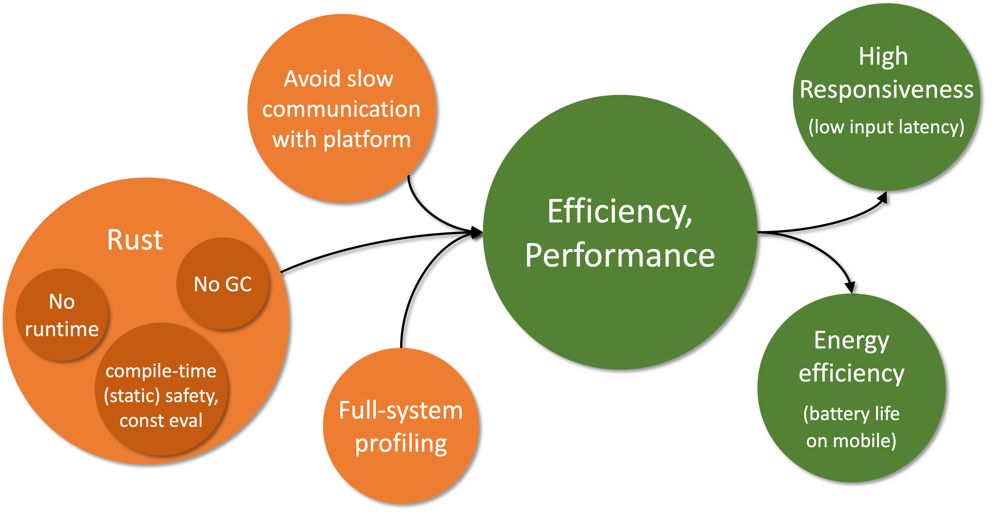

## Efficient, performant execution
The first and most important requirement falls under the runtime behavior category: high performance, efficient execution.
While this can be a bit of a nebulous goal, our general target is to be at least as performant and efficient as platform-native applications.
Specifically, the minimum performance requirement for Robius across all platforms is for standard application animations to be able to achieve a consistent framerate of 60 frames per second (FPS), which is the native framerate of most legacy device screens.
Efficiency-wise, apps built using Robius must not have a larger memory footprint nor consume more power than an equivalent app written using the platform-native SDK.

While 60FPS is the bare minimum, modern mobile devices typically support higher framerates, such as flagship smartphone screens and virtual/augmented reality head-mounted displays that operate at 90Hz or 120Hz;
high-end desktops and laptops frequently have monitors capable of even higher framerates up to 240Hz.
Therefore, the higher-end performance framerate that Robius will target is 120Hz, in order to fully leverage modern mobile hardware.

As pictured below, the central requirement of high efficiency and performance leads to follow-up requirements (in green) of *(1)* high responsiveness and *(2)* low energy consumption.
It also stems from prerequisite requirements (in orange) of *(1)* an efficient, performant implementation language (i.e., Rust), *(2)* the avoidance of slow communication mechanisms with the underlying platform, and *(3)* the availability of low-overhead, accurate profiling mechanisms across the system stack.

We discuss these individual post- and pre-requirements in more detail below.

### Pre-requirements: what leads to efficiency/performance?
Three main factors will contribute to the ability of Robius to meet these requirements: 
1. Using an efficient, performant language.
2. Using efficient mechanisms to communicate with the underlying platform.
3. Supporting a low-overhead mechanisms to profile the application, inclusive of the entire Robius stack.

#### Choice of Language

The first pre-requirement is already met by virtue of our project charter to use Rust.
As described in [a previous motivation subsection](../motivation/rust_is_right.md#rust-combines-safety-with-usability-and-performance), Rust is generally quite efficient because it does not have an underlying runtime or garbage collection (as with C and assembly), so nothing is required to run between the generated code and the machine code.
Another aspect that further contributes to the ability to achieve high performance with Rust is its aggressive reduction of runtime overhead via zero-cost abstractions and compile-time operations, e.g., type and memory safety analysis along with a powerful (and ever improving) engine for const evaluation.
Rust also makes concurrency easy to realize with confidence due to [built-in traits](https://doc.rust-lang.org/book/ch16-04-extensible-concurrency-sync-and-send.html) for defining [thread safety (`Send` and `Sync`)](https://doc.rust-lang.org/nomicon/send-and-sync.html), which reduces the complexity of and barrier to entry for improving performance by leveraging multi-core hardware.

#### Communication mechanisms

The second pre-requirement — using low-overhead mechanisms to communicate with the underlying platform — is one that both Osiris and the UI toolkit(s) will need to address
The most informative perspective from which we can look at this requirement is to examine what *not* to do, i.e., learn from the disadvantages of other cross-framework "bridge" approaches.
Bridge projects support interaction between app dev frameworks and other programming languages, both for native (e.g., Jetpack Compose, SwiftUI) and cross-platform frameworks (e.g., Flutter, React Native). 
However, they typically use (de)serialization to send data between the framework and other language, which sometimes also operate in different processes, requiring inter-process communication (IPC).
Both serialization, deserialization, and IPC mechanisms all contribute to high overhead, which in turn reduces efficiency (longer battery life and less thermal output), lowers responsiveness by imposing additional latency into the app's main event loop, and harms overall performance.

For Osiris, our guiding philosophy is to first expose direct unfettered access to native platform APIs with *no* abstraction layers atop them, i.e., implement platform functions and types via FFI/`extern` definitions.
Only after native features are fully exported via direct FFI will Osiris begin to develop low- to zero-cost abstractions atop these FFIs.
Thus, by using direct in-process foreign function calls and FFI-compatible type definitions instead of expensive IPC or serialization, we should be able to avoid platform communication overhead and meet this requirement for all non-UI componentry.
Note that Osiris also follows this philosophy for its build tooling.

Similarly, the Makepad UI toolkit has always been strongly against unnecessary or overly-deep abstraction layers, instead preferring to directly use platform-native functionality via in-house custom crates, which not only reduce runtime overhead to a bare minimum but also keep compile times very short.
Other UI toolkits may choose different points in the design space with varying tradeoffs between communication overhead and level of abstraction, but they must aim to keep these costs minimal by avoiding serialization and other expensive data marshalling operations wherever possible.

#### Profiling mechanisms

The third pre-requirement is to enable developers to easily profile the performance of any part of their application as well as any component within the Robius system stack.
This ties into the other requirements because profiling exists to help developers resolve performance problems by determining where bottlenecks and slowdowns exist in their code.

To meet this requirement, we aim to leverage standard sampling-based performance analysis and tools to generate accessible overviews, e.g., `perf` and flame graphs.
We also intend to implement detailed tracing mechanisms, à la [Linux's function tracing (ftrace)](https://www.kernel.org/doc/html/v4.18/trace/ftrace.html) or the Rust [`tracing`](https://crates.io/crates/tracing) crate, in order to allow developers to easily collect diagnostic data by turning on instrumentation events, ideally at module-level and/or criticality-level granularity.
In addition, we will provide detailed documentation on how to set up and use  existing debugging tools with the Robius framework, while ensuring that build toolchains are capable of emitting necessary debug info that is accurate for  all integrated Rust components.
Finally, we plan to openly collaborate with the [Oniro project](https://oniroproject.org/) on a joint endeavor to implement tracing support on new platforms like OpenHarmony.

As Robius continues to develop, we will expand upon our strategies to meet this requirement.

### Post-requirements: what stems from efficiency/performance?

The primary benefit of high performance and efficiency is *responsiveness*, while the secondary benefit is energy efficiency.

#### Responsiveness

Responsiveness is typically measured in terms of end-to-end latency: the elapsed time from when an input occurs to when the resulting visual change from that input is first displayed.
For most modern devices, this latency is on the order of tens to hundreds of milliseconds, i.e., 20ms – 150ms.
Low responsiveness (high input-to-display latency) is most noticeable and detrimental to the user experience on *touchscreen* devices, which are commonly found on mobile platforms and occasionally on laptops.
To understand why, check out this video from Microsoft Research's [classic touch input latency experiment](https://www.youtube.com/watch?v=vOvQCPLkPt4).

As with the other related requirements, our initial target is that an app using Robius must not exceed the latency of an equivalent app built for the native platform.
It is difficult to set a more precise target for input-to-display latency, as many impactful factors lie beyond our framework's control: the native platform's software latency, the underlying hardware (especially graphics accelerators), an application's implementation decisions, and so on.

One likely candidate to use as a basis for comparison is the responsiveness of scrolling a webpage in a platform-native webview, as web scrolling is a very common action that general users are familiar with and can understand and visualize.
[This series of experiments](https://danluu.com/input-lag/) shows latency measurements for web scrolling on a variety of mobile and desktop platforms, which could serve as a baseline starting point for this requirement; however, many of those figures are for older devices circa 2017. 
In the future, we may be able to set a more specific responsiveness goal for certain combinations of specific application behavior on specific platforms.

All of the aforementioned tactics to achieve high performance also apply to meeting latency requirements. 
In addition, we anticipate experimenting with ylong's support for priority-based async task scheduling, in which we can assign interactive tasks a higher priority than background tasks or those that do not directly affect the UX and UI responsiveness.
To the best of our knowledge, no other async frameworks offer a customizable notion of per-task priority.
This may bring a significant improvement compared to [`tokio`](https://tokio.rs/), the de facto async framework of choice, especially for applications that are heavily I/O-bound.

#### Energy efficiency

The secondary target benefit is energy efficiency, which is particularly important for battery-powered devices, e.g., mobile, embedded, and extended reality headsets.
This is reflected in nearly every market survey, in which [consumers rank battery life as the most important characteristic](https://9to5mac.com/2021/03/19/iphone-buyers-want-battery-life-over-5g/) when buying a smartphone.

As with the prior requirements, energy efficiency is affected by many disparate factors, so we again return to the conservative metric of Robius apps not being less efficient than equivalent apps written for the native platform.
Comparatively speaking, this requirement should be easier to meet due to the nature of Rust-generated machine code lacking overhead of an underlying runtime, VM, or garbage collector.
Clearly, the UI layer also has a significant impact on energy consumption, which is why our UI toolkits emphasize efficient operation in their design choices.
For example, Dioxus uses intelligent diffing to reduce the volume of updates required to its virtual DOM, which prevents unnecessary re-rendering operations;
Makepad bypasses the underlying webview component entirely, as they are known to be relatively heavyweight, in favor of directly accessing the native graphics layer to perform rendering operations.

A future line of work will involve supporting energy-aware and topology-aware scheduling of tasks/threads across heterogeneous CPU cores, which is common on mobile devices, e.g., [ARM's `dynamIQ` system](https://www.arm.com/technologies/dynamiq) (previously [`big.LITTLE`](https://www.arm.com/technologies/big-little)).
This will enable our concurrent/parallel execution layer to more intelligently utilize the hardware's available power budget by considering it jointly alongside the CPU topology and capability of each core.

<!-- cspell:ignore ftrace -->
