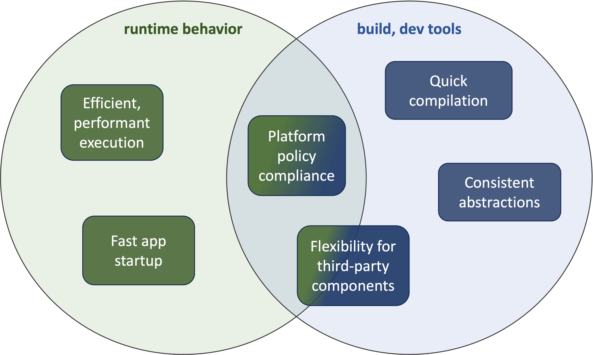

# Technical Requirements

This section expands on the requirements inherent to the success of the Robius vision and our initial strategies for how to meet them.
These requirements can also be seen as additional project goals, but more technical in nature than those in the previous chapter.

As shown in the following Venn diagram, we have split the set of target requirements into two broad categories: those related to runtime, and those related to build time or developer tooling.
Certain requirements touch on both runtime and build-time system aspects.
The following sections discuss each requirement in more detail.

