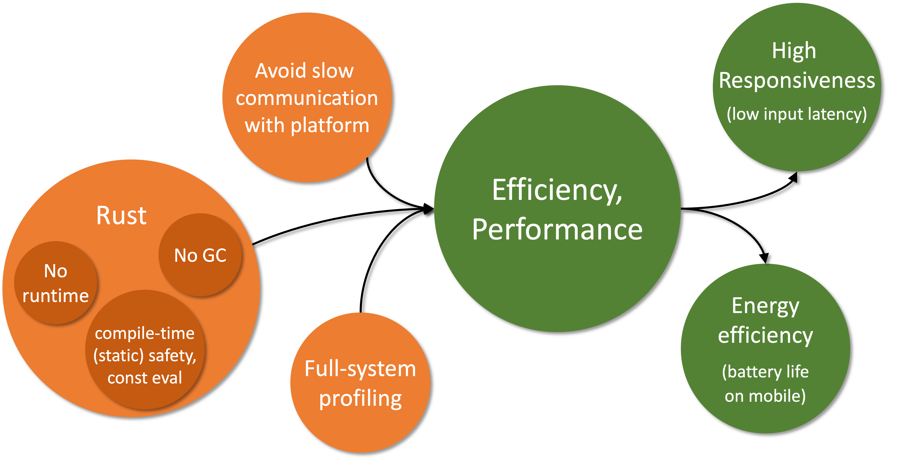

## Efficient, performant execution
The first and most important requirement falls under the runtime behavior category: high performance, efficient execution.
While this can be a bit of a nebulous goal, our general target is to be at least as performant and efficient as platform-native applications.
Specifically, the minimum performance requirement for Robius across all platforms is for standard application animations to be able to achieve a consistent framerate of 60 frames per second (FPS), which is the native framerate of most legacy device screens.
Efficiency-wise, apps built using Robius must not have a larger memory footprint nor consume more power than an equivalent app written using the platform-native SDK.

While 60FPS is the bare minimum, modern mobile devices typically support higher framerates, such as flagship smartphone screens and virtual/augmented reality head-mounted displays that operate at 90Hz or 120Hz;
high-end desktops and laptops frequently have monitors capable of even higher framerates up to 240Hz.
Therefore, the higher-end performance framerate that Robius will target is 120Hz, in order to fully leverage modern mobile hardware.

As pictured below, the central requirement of high efficiency and performance leads to follow-up requirements of high responsiveness and low energy consumption.
It also stems from prerequisite requirements of an efficient, performant implementation language (i.e., Rust), the avoidance of slow communication mechanisms with the underlying platform, and the availability of low-overhead, accurate profiling mechanisms across the system stack.
We discuss these individual post- and pre-requirements in more detail below.

### Pre-requirements: what leads to efficiency/performance?
Three main factors will contribute to the ability of Robius to meet these requirements: 
1. Using an efficient, performant language.
2. Using efficient mechanisms to communicate with the underlying platform.
3. Supporting a low-overhead mechanisms to profile the application, inclusive of the entire Robius stack.

#### Choice of Language

The first pre-requirement is already met by virtue of our project charter to use Rust.
As described in [a previous motivation subsection](../motivation/rust_is_right.md#rust-combines-safety-with-usability-and-performance), Rust is generally quite efficient because it does not have an underlying runtime or garbage collection (as with C and assembly), so nothing is required to run between the generated code and the machine code.
Another aspect that further contributes to the ability to achieve high performance with Rust is its aggressive reduction of runtime overhead via zero-cost abstractions and compile-time operations, e.g., type and memory safety analysis along with a powerful (and ever improving) engine for const evaluation.
Rust also makes concurrency easy to realize with confidence due to [built-in traits](https://doc.rust-lang.org/book/ch16-04-extensible-concurrency-sync-and-send.html) for defining [thread safety (`Send` and `Sync`)](https://doc.rust-lang.org/nomicon/send-and-sync.html), which reduces the complexity of and barrier to entry for improving performance by leveraging multi-core hardware.

#### Communication mechanisms

The second pre-requirement — using low overhead mechanisms to communicate with the underlying platform — is one that both Osiris and the UI toolkit(s) will need to address
The most informative perspective from which we can look at this requirement is to examine what *not* to do, i.e., learn from the disadvantages of other cross-framework "bridge" approaches.
Bridge projects support interaction between app dev frameworks and other programming languages, both for native (e.g., Kotlin + Android SDK, SwiftUI) and cross-platform frameworks (e.g., Flutter, React Native). 
However, they typically use (de)serialization to send data between the framework and other language, which sometimes also operate in different processes, requiring inter-process communication (IPC).
Both serialization, deserialization, and IPC mechanisms all contribute to high overhead, which in turn reduces efficiency (battery life), lowers reponsiveness by imposing additional latency into the app's main event loop, and harms overall performance.

For Osiris, our guiding philosophy is to first expose direct unfettered access to native platform APIs with *no* abstraction layers atop them, i.e., implement platform functions and types via FFI/`extern` definitions.
Only after native features are fully exported via direct FFI will Osiris begin to develop low- to zero-cost abstractions atop these FFIs.
Thus, by using direct in-process foreign function calls and FFI-compatible type definitions instead of expensive IPC or serialization, we should be able to meet this requirement for all non-UI componentry.
Note that Osiris also follows this philosophy for its [build tooling](build_dev_requirements.md).

Similarly, the Makepad UI toolkit has always been strongly against unnecessary or overly-deep abstraction layers, instead preferring to directly use platform-native functionality via in-house custom crates, which not only reduce runtime overhead to a bare minimum but also keep compile times very short.
Other UI toolkits may choose different points in the design space with varying tradeoffs between communication overhead and level of abstraction, but they must aim to keep these costs minimal by avoiding serialization and other expensive data marshalling operations wherever possible.

#### Profiling mechanisms

Linux ftrace

Sampling-based perf + flamegraphs

OpenHarmony/Oniro profiling effort

### Post-requirements: what stems from efficiency/performance?

The primary benefit of interest is *responsiveness*

This can be achieved targeting high performance and efficiency is  performanceResponsiveness 

Responsiveness is typically measured in terms of end-to-end latency: the elapsed time from when an input occurs to when the resulting visual change from that input is first displayed.
For most modern devices, this latency is on the order of tens to hundreds of milliseconds.
Low responsiveness (high input-to-display latency) is most noticeable and detrimental to the user experience on *touchscreen* devices, which are commonly found on mobile platforms and ocassionally on laptops.

It is difficult to set a precise target for input-to-display latency, but a conservative target is that the underlying Robius framework components must not contribute more than 50%.

TODO: mention experimenting with ylong's support for priority-based async task scheduling, in which we can assign interactive tasks a higher priority than background tasks or those that do not directly affect the UX and UI responsiveness.

TODO: Use [this link](https://danluu.com/input-lag/) that shows web scrolling latency measurements as a basis for responsiveness requirements, as scrolling a webpage is the most common action that general users are familiar with and can understand and visualize.

[classic touch input latency experiment from Microsoft Research](https://www.youtube.com/watch?v=vOvQCPLkPt4)

The secondary target benefit is energy efficiency, which is particularly important for achieving a long usable battery life on battery-powered devices.

TODO: finish

TODO: mention the future concurrency management component having support for energy-aware scheduling of tasks/threads on heterogeneous CPU cores, e.g., big.LITTLE and ARM's dynamIQ system.

## Fast application startup
Coming Soon!

research shows that 59 percent of users dislike a slow launch and expect apps to open within two seconds.
